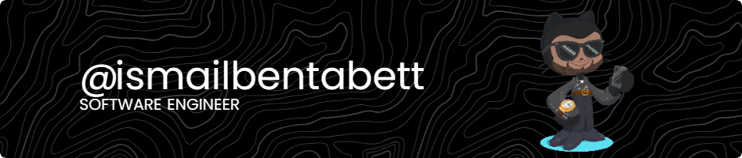

  

###

###
## 🌐 Socials:

               

###

  
  
  
  
  
  
  
  
  
  
  
  
  
  
  
  
  
  
  
  
  
  
  
  
  
  
  

  
  
  

###
# 📊 GitHub Stats: 
 
 

# 🚀 Leetcode Stats For Life: 

---

